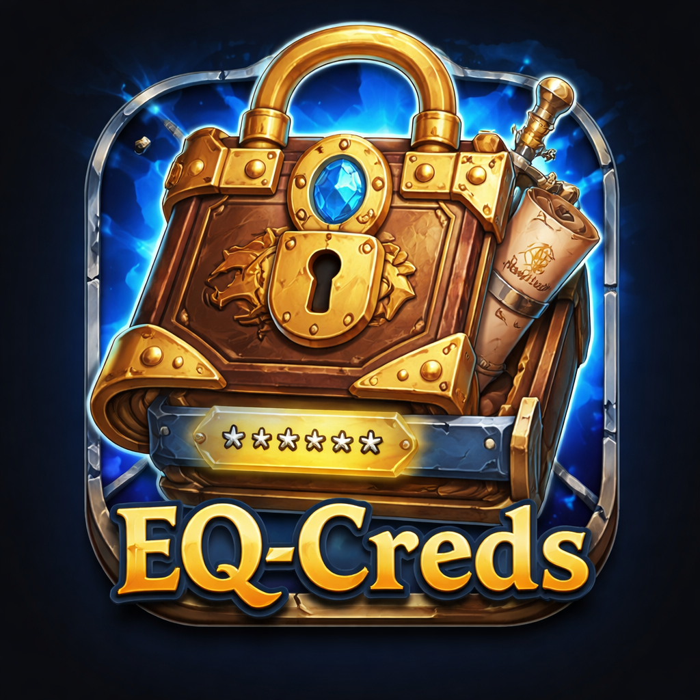
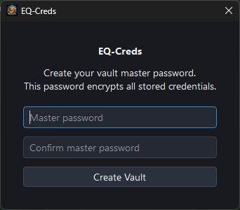
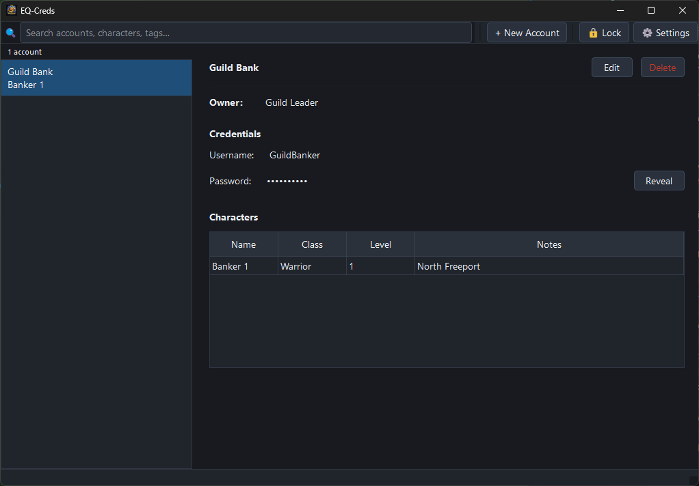
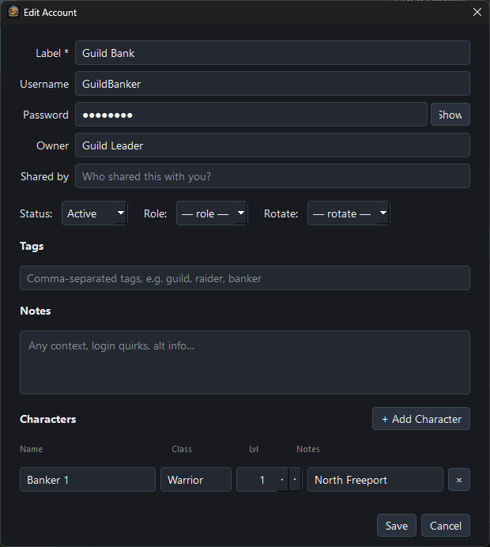
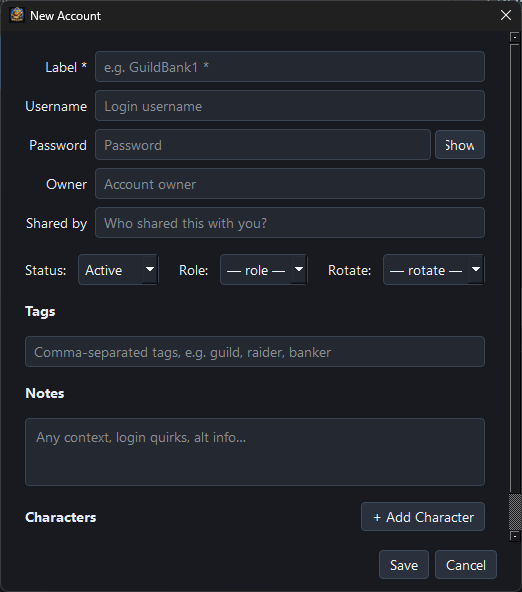
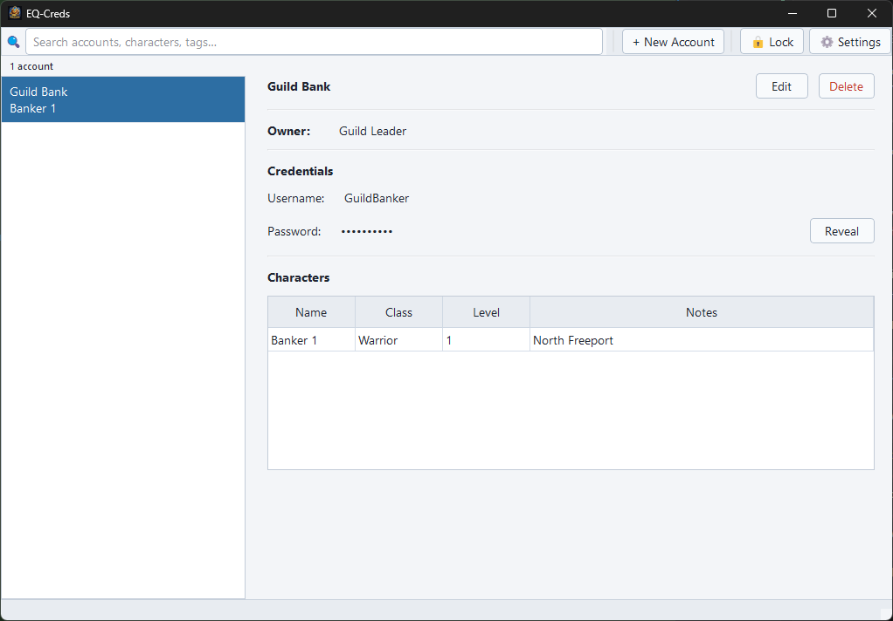
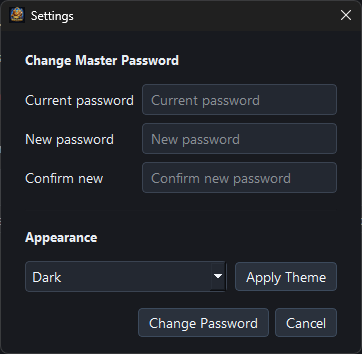

# EQ-Creds

<p align="center">
	
</p>

<p align="center">
	Windows-first local credential organizer for low-security shared Project 1999 / EverQuest accounts.
</p>

EQ-Creds is a Windows-first local desktop app for organizing low-security shared Project 1999 / EverQuest account credentials.

It is intentionally local-only and intentionally narrow in scope:

- No cloud sync
- No telemetry
- No browser extension behavior
- No interaction with the game client
- No login automation, hooks, overlays, or client manipulation

This is not an enterprise password manager. It is a practical local vault for a specific low-risk use case: keeping shared P99 account credentials out of pinned Discord messages and plaintext notes.

## What It Does

- Stores account credentials in an encrypted local vault
- Organizes one account to many characters
- Tracks owner / shared-by context
- Adds notes and tags for quick retrieval
- Provides fast search by account, character, owner, and tags
- Masks passwords by default with explicit reveal on demand
- Exports accounts to an encrypted `.eqcx` bundle protected by a separate password
- Imports `.eqcx` bundles with a full preview and per-account conflict resolution
- Runs as a Windows executable without requiring Python to be installed

## Current Version

Version: `1.1.0`

## Core Features

- Local encrypted storage using SQLite + AES-256-GCM
- Master password unlock
- Character-aware account records
- Search-first layout
- Light and dark themes
- Secure export to encrypted `.eqcx` bundles with a separate export password
- Guided import with conflict detection (Merge or Skip per account)
- Windows executable packaging via PyInstaller

## Safe Product Boundary

EQ-Creds does **not**:

- read from the EverQuest client
- inject into the client
- automate login entry
- scrape logs
- provide overlays
- manipulate or control the game in any way

That boundary is intentional and permanent.

## Security Model

EQ-Creds is designed for low-security credential organization, not enterprise-grade secret management.

- Vault location: `%APPDATA%\EQCreds\vault.db`
- Sensitive fields are encrypted at rest
- Master password key derivation uses Argon2id
- Encrypted fields use AES-256-GCM
- Session key is kept in memory only while unlocked
- No plaintext markdown or browser storage

Practical note:

- Account metadata such as labels, tags, and character names are stored in plaintext inside the local vault database so search stays fast and simple.

## Download

Download the latest Windows build from the GitHub Releases page.

Expected release asset:

- `EQCreds.exe`

## Installation

No installer is required for `1.0`.

1. Download `EQCreds.exe` from Releases.
2. Run the executable.
3. On first launch, create a master password.
4. Your vault will be created in `%APPDATA%\EQCreds\vault.db`.

## Usage

### Create a Vault

On first launch, enter and confirm a master password.

### Add an Account

Create a record with:

- label / account name
- username
- password
- optional owner
- optional shared-by source
- tags
- notes
- one or more characters

### Search

The main search box matches:

- account label
- character names
- owner
- shared-by
- tags

### View Credentials

- Username is shown directly
- Password is masked by default
- Password can be revealed explicitly when needed

### Export Accounts

Use the **⬆ Export** toolbar button to create an encrypted `.eqcx` backup:

1. Select the accounts to include (Select All / Deselect All available).
2. Set an export password — independent of the vault master password.
3. Choose a save path; defaults to `eqcreds-export-YYYY-MM-DD.eqcx`.

The bundle is protected with AES-256-GCM using a key derived from the export password. It cannot be opened without that password.

### Import Accounts

Use the **⬇ Import** toolbar button to load accounts from a `.eqcx` file:

1. Browse to the `.eqcx` file and enter its export password.
2. Click **Preview** — a table shows every account in the bundle with its label, username, and character count.
   - Accounts that don't exist in the vault are marked **New**.
   - Accounts that match an existing entry show a **Skip / Merge** selector.
3. Optionally use **Merge All** or **Skip All** to bulk-set conflict resolution.
4. Click **Import** to apply.

## Screenshots

### First Launch

Create or unlock the local vault with a master password.



### Main Search View

The main window is built around fast retrieval by account, character, owner, and tags.



### Account Detail View

Inspect a credential record, review linked characters, and reveal the password only when needed.



### Add or Edit Accounts

Each account can hold multiple characters, along with notes, tags, owner, and source context.



### Light Theme

The app supports both dark and light themes for readability on different desktops.



### Settings

Settings currently cover theme selection and master password changes.



## FAQ

### Is this a password manager?

Not in the enterprise sense. EQ-Creds is a small local vault for a specific low-risk use case.

### Does this interact with EverQuest or Project 1999?

No. It does not read the client, inject into the client, automate logins, or interact with the game process.

### Where is the vault stored?

The vault lives at `%APPDATA%\EQCreds\vault.db`.

### What is encrypted?

Sensitive credential fields are encrypted at rest. Search-oriented metadata such as labels, tags, and character names remain plaintext inside the local database so the app can stay fast and simple.

### Do I need Python installed to use it?

No. End users should download the packaged Windows executable from Releases.

### Does it run on Linux or macOS?

No prebuilt binary is provided. The source is pure Python + PySide6 and is otherwise portable, but the vault path is currently hardcoded to `%APPDATA%` (Windows only). Running from source on Linux or macOS requires changing the vault path in `main.py` to an appropriate platform directory (e.g. `~/.local/share/EQCreds` on Linux or `~/Library/Application Support/EQCreds` on macOS) before it will work.

### Can one account have multiple characters?

Yes. One account can map to many characters, and the UI is built around that.

## Data Model Summary

Each account can contain:

- one account label
- one username
- one password
- optional owner
- optional shared-by value
- optional notes
- optional tags
- up to many associated characters

Each character can store:

- name
- class
- level
- optional notes

## Build From Source

Requirements:

- Windows
- Python 3.9+

Install dependencies:

```powershell
python -m venv .venv
.\.venv\Scripts\pip.exe install -r requirements.txt
```

Run the app:

```powershell
.\.venv\Scripts\python.exe main.py
```

Run tests:

```powershell
.\.venv\Scripts\python.exe -m pytest tests/ -v
```

Build the executable:

```powershell
.\.venv\Scripts\pyinstaller.exe build.spec
```

Output:

- `dist/EQCreds.exe`

## Icon Build Behavior

The build automatically looks for an icon in `assets/`.

Priority order:

1. `assets/icon.ico`
2. `assets/icon.png`
3. `assets/EQ-Creds.png`

If only a PNG is present, the build converts it to `assets/icon.ico` automatically before packaging.

## Known Limitations

- Local-only in `1.0`
- No sync or multi-device sharing
- No import pipeline yet
- No audit trail yet
- Optimized for Windows first

## Roadmap Direction

Potential future work:

- controlled sharing between trusted users/devices
- encrypted import/export
- optional audit logging
- optional sync

These are future ideas, not part of `1.0`.

## Building from Source

To build the `.exe` from source:

```bash
git clone https://github.com/yourusername/eq-creds.git
cd eq-creds
python -m venv .venv
.venv\Scripts\activate
pip install -r requirements.txt
python -m pytest tests/  # Optional: run test suite (27 tests)
python -m pyinstaller build.spec
# Output: dist/EQCreds.exe
```

For v1.0.0 release details and known limitations, see [RELEASE_NOTES.md](RELEASE_NOTES.md).
